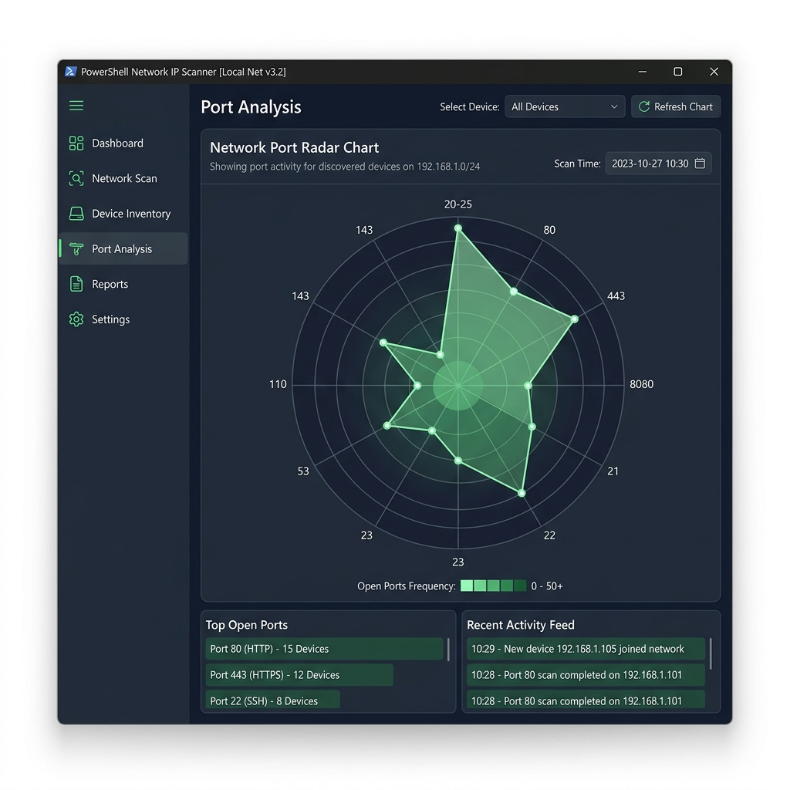

# PSNetworkScanner 📡



**PSNetworkScanner** is a fast, multi-threaded PowerShell IP and port scanner utility featuring a modern dark WPF interface for discovering active host devices and network services across local LAN subnets.

---

## 🌟 Features

- 🎨 **Modern Dark Mode Interface**: Visual dashboard displaying online network hosts, response times, hostnames, and MAC addresses.
- ⚡ **Asynchronous Subnet Scanning**: Ultra-fast multi-threaded ICMP ping sweeps over customizable IPv4 ranges (e.g. `192.168.1.1/24`).
- 🔌 **Port Scanning & Service Audit**: Probe common TCP ports (HTTP, HTTPS, SSH, RDP, SMB, FTP) across discovered hosts.
- 📋 **Device Inventory Export**: Save scan audit reports directly to CSV or JSON formats.

---

## 📋 Requirements

- **Operating System**: Windows 10, Windows 11, or Windows Server 2016+
- **PowerShell**: PowerShell 5.1 or PowerShell 7+

---

## 🚀 How to Run

1. Open PowerShell terminal.
2. Navigate to `PSNetworkScanner`:
   ```powershell
   cd "c:\AI\Code\New folder\PSNetworkScanner"
   ```
3. Run `PSNetworkScanner.ps1`:
   ```powershell
   .\PSNetworkScanner.ps1
   ```
